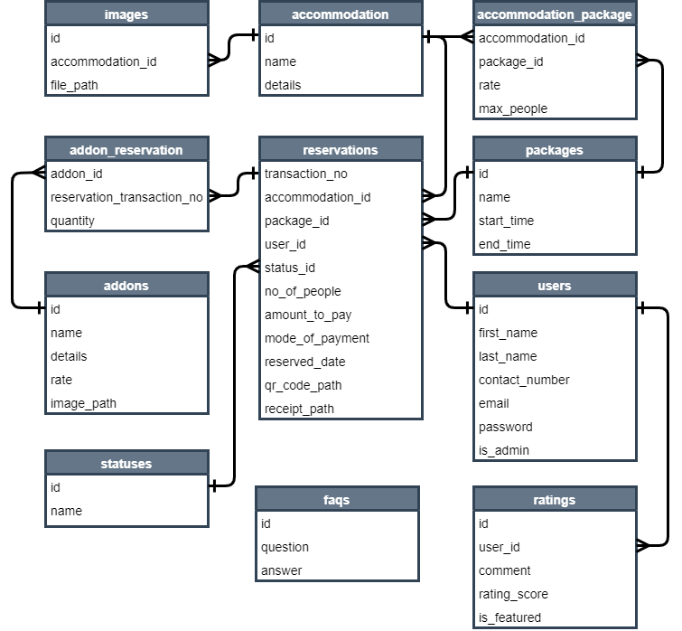

# Villa Capco Resort
## About
A resort management system complete with **booking**, **book cancellation**, **session management (login & logout)**, **forgot password**, **email verification**, and **admin panel**.
This system handles different roles: **admin**, **authenticated user**, and **unauthenticated user**.
role | allowed actions
-- | --
admin | change *per night* rate, monitor reviews, change status of reservation.
authenticated user | book a room, update contact information.
unauthenticated user | book a room
> Authenticated users are those users who created an account for the website. Unauthenticated users on the otherhand did not create an account. Both users *can* book a room so creating an account is *not required*.<br>
> You can read more about the roles and permission [here](#use-case-diagram).

## Installation
### Prerequisite
- [PHP](https://www.php.net/) *at least version 8.1.0*
- [MySQL](https://www.mysql.com/) *at least version 8.0.29* **or** [MariaDB](https://mariadb.org/) *at least version 10.7.3*
- [Composer](https://getcomposer.org/) *at least version 2.3.4*
- [Node.JS](https://nodejs.org/en/) *at least version 16.14.0*
> *Composer* also has a [Composer-Setup.exe](https://getcomposer.org/Composer-Setup.exe) for **Windows OS**. This is the easiest way to install *Composer* in your machine.
## If you're using Windows OS
- you could install [XAMPP](https://www.apachefriends.org/download.html)
> Select the middle option as the first installer contains the previous version while the last contains the latest unstable release* in short the middle installer is the **latest stable release**.
> **XAMPP** contains **PHP** and **MySQL** so you can skip first two prerequisites

### Guide
> You can put the source code wherever directory you want. You can put them inside `Documents` or `Documents/Codes`
Clone the repository and go to `villa-capcoresort-reservation` directory.
> Open a terminal preperably `Git Bash`
> You may be ask to login so just click the link that will be shown.
```terminal
git clone https://github.com/Philiks/villa-capco-resort-reservation.git
cd villa-capco-resort-reservation
```
copy the `.env.example` and named it `.env`.
> This contains the environment variables such as **application name**, **database connection**, and **url**.
```terminal
cp .env.example .env
```
Create database.
> You may create the database by any method that you prefer. The snippet below uses the MariaDB CLI.
> You can use `http://localhost/phpmyadmin` to create your database. Just make sure the name of the dabatase is `villa_capco`
```terminal
mariadb -u root -p
MariaDB [(none)]> CREATE DATABASE villa_capco;
MariaDB [(none)]> quit
```
Install composer packages.
```terminal
composer install
```
Install node packages.
```terminal
npm install
```
Generate application key.
```terminal
php artisan key:generate
```
Create a symbolic link to access storage static files from public.
```terminal
php artisan storage:link
```
Migrate `database/migrations` files and run `database/seeders` as well.
```terminal
php artisan migrate --seed
```
Finally, start the laravel server and the node server.
> This are the only step you need to do if you've already done every steps.<br>
> **You should not terminate this command while you're using the website.** Otherwise press `ctrl + C` to terminate the command. 
```terminal
php artisan serve
```
> In another terminal.
```terminal
npm run dev
```

## Routes
There are different routes that you can traverse. To start, just go to `localhost:8000/` to go to the homepage. From there, you can visit different pages meant for the users (both authenticated and unauthenticated).<br>
To access the admin panel, you must go to the admin subdomain `localhost:8000/admin`. This will redirect to login page if you have not started any session yet. Here is the admin credentials provided by the seeder:

**Email:** admin@admin.com<br>
**Password:** superadmin

## Entity Relationship Diagram (ERD)
Shows the relationship of database tables with their cardinality (many-to-many, one-to-many, etc).

